# Data Analyst Agent - Comprehensive Project Documentation

## 1. Executive Summary

### What problem this project solves
This project is an interactive data analysis assistant for non-technical and technical users who need to upload datasets, clean them, explore them, generate charts, detect anomalies, forecast values, and ask questions in plain English. It reduces the manual work of exploratory analysis by combining a Streamlit UI, Pandas-based analytics, a safe code execution sandbox, Hugging Face LLM calls, LangChain orchestration, and LlamaIndex document retrieval.

### Target users
- Business analysts who want quick answers from CSV, Excel, JSON, SQLite, and document uploads.
- Data analysts who need a faster exploratory workflow.
- Managers who want executive summaries and report exports.
- Technical users who want to inspect generated Pandas code and charts.
- Contributors who want a lightweight AI analytics app architecture to extend.

### Real-world use cases
- Ask: "Which region had the highest revenue last month?"
- Upload a PDF report and ask questions about its content.
- Clean a dataset by removing duplicates, imputing missing values, and normalizing column names.
- Detect outliers in numeric columns with Isolation Forest, Z-Score, or IQR.
- Forecast a metric using moving average, linear trend, or exponential smoothing.
- Export HTML and Excel reports with summaries and profiles.

### Main features
- Multi-format ingestion: CSV, Excel, JSON, SQLite, TXT, DOCX, PDF, and images via OCR.
- Dataset registry and session-based active dataset tracking.
- Data cleaning workflow with quality scoring and version snapshots.
- Interactive explorer with distributions, correlations, filters, and column profiling.
- AI Query workflow: natural language to Pandas code to safe execution to insights.
- Visualizations studio with many chart types.
- Statistical insights and LLM-generated business insights.
- Forecasting and anomaly detection modules.
- Document QA with LlamaIndex-backed retrieval.
- HTML and Excel report generation.
- Theme toggle and model settings in the sidebar.

### Technology stack
- Programming language: Python.
- UI framework: Streamlit.
- Data layer: Pandas and NumPy.
- Visualization: Plotly, Matplotlib, Seaborn.
- ML / analytics: scikit-learn, SciPy, statsmodels.
- LLM provider: Hugging Face Inference Providers API.
- Agent/orchestration layer: LangChain.
- Retrieval layer: LlamaIndex.
- File parsing: openpyxl, xlrd, python-docx, PyMuPDF, Pillow, pytesseract, chardet.
- Reporting: Jinja2-style HTML generation, openpyxl, reportlab, fpdf2.

### External APIs
- Hugging Face router endpoint: `https://router.huggingface.co/v1/chat/completions`.
- The app calls it for code generation, repairs, narrative insights, and document QA responses.

### Databases
- No persistent application database is implemented.
- SQLite is supported as an input file format and parsed into Pandas DataFrames.
- All application state is stored in Streamlit session state.

### AI / ML models used
- Default model chain uses Hugging Face chat models configured in session state.
- Common models in the config are `deepseek-ai/DeepSeek-R1` and, in older prompts, `Qwen/Qwen3-32B`.
- LangChain wraps the orchestration path but still delegates final model calls to the Hugging Face client.
- LlamaIndex uses an embedding-backed vector index when available, with Hugging Face embeddings or a mock embedding fallback.

### Why this architecture was chosen
The architecture keeps the app simple for Streamlit deployment while separating concerns:
- UI pages only orchestrate interactions.
- `modules/` contains the analytical logic.
- `utils/` handles session, config, and navigation.
- `modules/llm_client.py` centralizes API access and retry behavior.
- `modules/executor.py` isolates unsafe generated code inside a sandbox.
- LangChain and LlamaIndex are used only where they add value: orchestration and retrieval.

---

## 2. Folder Structure

### Root files

#### [app.py](app.py)
- Responsibility: application entry point.
- Purpose: configures Streamlit, loads config, initializes session state, injects theme CSS, and renders navigation.
- Dependencies: `streamlit`, `utils.config`, `utils.session`, `utils.navigation`.
- Interaction: starts the entire UI lifecycle and hands control to the router.

#### [requirements.txt](requirements.txt)
- Responsibility: Python dependency manifest.
- Purpose: records the runtime and AI stack dependencies.
- Dependencies: used by pip install during setup and deployment.
- Interaction: defines the environment for the whole project.

#### [README.md](README.md)
- Responsibility: public-facing project overview.
- Purpose: quick start, feature summary, deployment notes, and folder overview.
- Dependencies: documentation only.
- Interaction: should act as the landing page for contributors and users.

#### [PROJECT_DOCUMENTATION.md](PROJECT_DOCUMENTATION.md)
- Responsibility: comprehensive technical documentation.
- Purpose: detailed architecture, module analysis, diagrams, security, testing, and interviews.
- Dependencies: derived from the codebase.
- Interaction: deeper reference document for maintainers.

#### [test_hf.py](test_hf.py)
- Responsibility: manual Hugging Face connectivity test.
- Purpose: sends a simple chat request using the session key.
- Dependencies: `requests`, `streamlit`.
- Interaction: validates whether the configured HF token can reach the inference router.

#### [.gitignore](.gitignore)
- Responsibility: repository hygiene.
- Purpose: ignores virtualenvs, secrets, uploads, generated exports, logs, caches, and notebook artifacts.
- Dependencies: Git.
- Interaction: prevents large or sensitive files from being committed.

### Configuration folder

#### [.streamlit/config.toml](.streamlit/config.toml)
- Responsibility: Streamlit runtime theming and server settings.
- Purpose: defines the dark theme and upload size limit.
- Dependencies: Streamlit.
- Interaction: controls UI defaults and server behavior.

#### [.streamlit/secrets.toml.example](.streamlit/secrets.toml.example)
- Responsibility: secret template.
- Purpose: tells users where to place `HF_API_KEY`.
- Dependencies: Streamlit secrets mechanism.
- Interaction: local and cloud deployment key configuration.

### `app_pages/`

This folder contains the user-facing screens routed from the sidebar.

#### [app_pages/dashboard.py](app_pages/dashboard.py)
- Responsibility: overview dashboard.
- Purpose: shows KPIs, a sample preview, column type breakdown, recent queries, and loaded dataset summary.
- Dependencies: Plotly, Pandas, NumPy, session helpers.
- Interaction: reads dataset metadata and query history from session state.

#### [app_pages/upload.py](app_pages/upload.py)
- Responsibility: upload and sample-data entrypoint.
- Purpose: accepts files, parses them, registers datasets, builds LlamaIndex bundles for text inputs, and loads sample datasets.
- Dependencies: `modules.ingestion`, `modules.document_rag`, `utils.session`.
- Interaction: seeds the rest of the app by populating `st.session_state.datasets`.

#### [app_pages/cleaning.py](app_pages/cleaning.py)
- Responsibility: cleaning workflow UI.
- Purpose: configures and executes cleaning, shows quality score changes, and allows versioned application of cleaned data.
- Dependencies: `modules.cleaning`, `utils.session`.
- Interaction: updates the active dataset and stores a snapshot before modification.

#### [app_pages/explorer.py](app_pages/explorer.py)
- Responsibility: exploratory data analysis UI.
- Purpose: browse rows, inspect distributions, correlation matrices, filters, and column profiles.
- Dependencies: Pandas, NumPy, Plotly, session helpers.
- Interaction: operates on the active dataframe directly.

#### [app_pages/ai_query.py](app_pages/ai_query.py)
- Responsibility: AI question answering UI for structured data.
- Purpose: collects a question, calls the LangChain-backed query pipeline, renders code, outputs, charts, and insights.
- Dependencies: `modules.langchain_query`, `utils.session`, Matplotlib.
- Interaction: saves query history and displays execution results.

#### [app_pages/document_qa.py](app_pages/document_qa.py)
- Responsibility: document question answering UI.
- Purpose: answers questions against uploaded text documents using LlamaIndex retrieval or fallback similarity search.
- Dependencies: `modules.document_rag`.
- Interaction: only works when the active dataset is a text document.

#### [app_pages/visualizations.py](app_pages/visualizations.py)
- Responsibility: chart-building UI.
- Purpose: lets the user build many chart types with configurable axes, colors, templates, and save them to history.
- Dependencies: Plotly, Pandas, NumPy, session state.
- Interaction: reads the active dataframe and renders interactive charts.

#### [app_pages/insights.py](app_pages/insights.py)
- Responsibility: insights page UI.
- Purpose: shows deterministic statistical insights and optionally requests structured AI business insights.
- Dependencies: `modules.insights`, `utils.session`.
- Interaction: caches the last generated insights in session state.

#### [app_pages/forecasting.py](app_pages/forecasting.py)
- Responsibility: forecasting UI.
- Purpose: lets the user choose a numeric series and run moving average, linear trend, or exponential smoothing forecasts.
- Dependencies: `modules.forecasting`, Plotly, NumPy, Pandas.
- Interaction: stores forecast results in session state.

#### [app_pages/anomalies.py](app_pages/anomalies.py)
- Responsibility: anomaly detection UI.
- Purpose: detects anomalous rows using Isolation Forest, Z-Score, or IQR and presents a chart and export.
- Dependencies: `modules.anomaly_detection`, NumPy, Pandas.
- Interaction: stores the last anomaly result in session state.

#### [app_pages/reports.py](app_pages/reports.py)
- Responsibility: report export UI.
- Purpose: generates HTML and Excel reports and renders an in-app profile.
- Dependencies: `modules.insights`, session helpers, Pandas, NumPy.
- Interaction: consumes active dataset, metadata, and cached AI insights.

#### [app_pages/settings.py](app_pages/settings.py)
- Responsibility: settings UI.
- Purpose: lets users configure API keys, models, inference settings, theme, and review dataset version history.
- Dependencies: Streamlit session state.
- Interaction: changes are picked up by the next query or render cycle.

#### [app_pages/__init__.py](app_pages/__init__.py)
- Responsibility: package marker.
- Purpose: keeps the page folder importable.
- Dependencies: none.
- Interaction: supports Python package semantics.

### `modules/`

This folder contains the actual analytical engine.

#### [modules/llm_client.py](modules/llm_client.py)
- Responsibility: Hugging Face API client.
- Purpose: sends chat completion requests, strips reasoning traces, retries on throttling, and normalizes error messages.
- Dependencies: `requests`, Streamlit session state.
- Interaction: used by all AI-powered features.

#### [modules/executor.py](modules/executor.py)
- Responsibility: sandboxed code execution.
- Purpose: validates AI-generated code, strips imports and dangerous calls, runs it in a restricted namespace, and captures stdout, figures, and DataFrames.
- Dependencies: Pandas, NumPy, Plotly, Matplotlib, Seaborn, AST.
- Interaction: powers the AI Query workflow.

#### [modules/query_engine.py](modules/query_engine.py)
- Responsibility: dataframe question pipeline.
- Purpose: builds prompts, asks the LLM for Pandas code, executes the code, optionally repairs failed code, and then asks for grounded insights from the actual execution result.
- Dependencies: `modules.llm_client`, `modules.executor`.
- Interaction: used by AI Query and by the LangChain wrapper.

#### [modules/langchain_query.py](modules/langchain_query.py)
- Responsibility: LangChain orchestration adapter.
- Purpose: wraps the dataframe query flow in LangChain prompt/runnable objects when LangChain is installed.
- Dependencies: LangChain core, `modules.query_engine`, `modules.llm_client`, `modules.executor`.
- Interaction: currently used by the AI Query page.

#### [modules/document_rag.py](modules/document_rag.py)
- Responsibility: LlamaIndex document retrieval.
- Purpose: chunks text uploads, builds a vector index when possible, retrieves top chunks, and prompts the LLM to answer only from retrieved context.
- Dependencies: LlamaIndex core, Hugging Face embeddings if available, `modules.llm_client`.
- Interaction: used by upload and document QA pages.

#### [modules/ingestion.py](modules/ingestion.py)
- Responsibility: file parsing and metadata extraction.
- Purpose: loads CSV, Excel, JSON, SQLite tables, plain text, Word, PDF, and image OCR into DataFrames or text payloads.
- Dependencies: Pandas, NumPy, chardet, sqlite3, PyMuPDF, python-docx, Pillow, pytesseract.
- Interaction: feed for dataset registry and document indexing.

#### [modules/cleaning.py](modules/cleaning.py)
- Responsibility: dataset cleaning engine.
- Purpose: computes quality scores, normalizes names, fixes dtypes, fills missing values, drops duplicates, and removes outliers.
- Dependencies: Pandas, NumPy, dataclasses.
- Interaction: used by the cleaning UI and dataset versioning.

#### [modules/anomaly_detection.py](modules/anomaly_detection.py)
- Responsibility: anomaly detection algorithms.
- Purpose: provides Isolation Forest, Z-Score, and IQR-based anomaly detection with visualizations.
- Dependencies: scikit-learn, Plotly, Pandas, NumPy.
- Interaction: used by the anomaly page.

#### [modules/forecasting.py](modules/forecasting.py)
- Responsibility: forecasting algorithms.
- Purpose: implements moving average, linear regression trend, and exponential smoothing forecasts.
- Dependencies: scikit-learn, Plotly, Pandas, NumPy.
- Interaction: used by the forecasting page.

#### [modules/insights.py](modules/insights.py)
- Responsibility: statistical and narrative insights.
- Purpose: produces rule-based insights and structured LLM insights as JSON-like output.
- Dependencies: `modules.llm_client`, Pandas, NumPy.
- Interaction: used by the insights page and the HTML report generator.

#### [modules/__init__.py](modules/__init__.py)
- Responsibility: package marker.
- Purpose: keeps the module folder importable.
- Dependencies: none.
- Interaction: supports package-style imports.

### `utils/`

#### [utils/config.py](utils/config.py)
- Responsibility: configuration bootstrap.
- Purpose: resolves the Hugging Face API key from secrets or environment, initializes model settings, theme, and inference defaults.
- Dependencies: Streamlit session state and `os`.
- Interaction: called at application startup.

#### [utils/session.py](utils/session.py)
- Responsibility: session state registry.
- Purpose: initializes defaults, stores datasets, text indexes, active dataset, query history, version snapshots, and helper accessors.
- Dependencies: Streamlit session state, datetime.
- Interaction: central mutable state layer for the whole app.

#### [utils/navigation.py](utils/navigation.py)
- Responsibility: sidebar router.
- Purpose: renders navigation buttons, API key entry, dataset switcher, theme toggle, clear-session action, and dispatches to the selected page.
- Dependencies: Streamlit and page modules.
- Interaction: controls the whole page routing lifecycle.

#### [utils/__init__.py](utils/__init__.py)
- Responsibility: package marker.
- Purpose: keeps the utility folder importable.
- Dependencies: none.
- Interaction: supports imports like `from utils.session import ...`.

---

## 3. High-Level Architecture

### Overall System Architecture
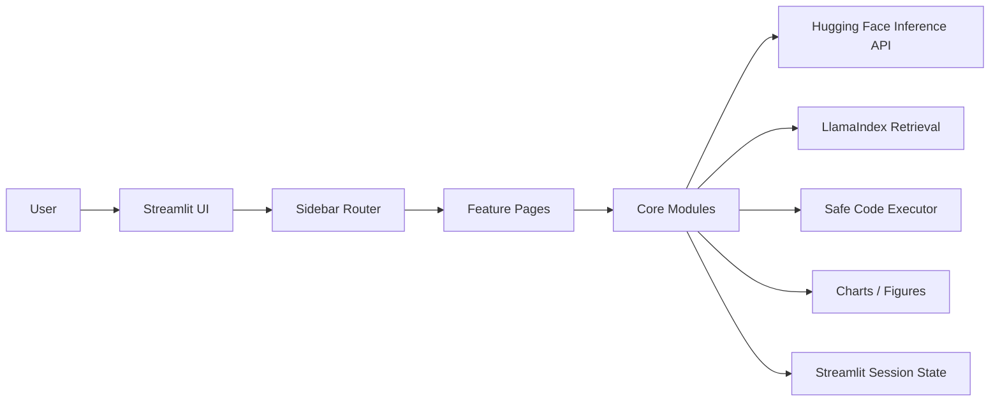

### Component Diagram
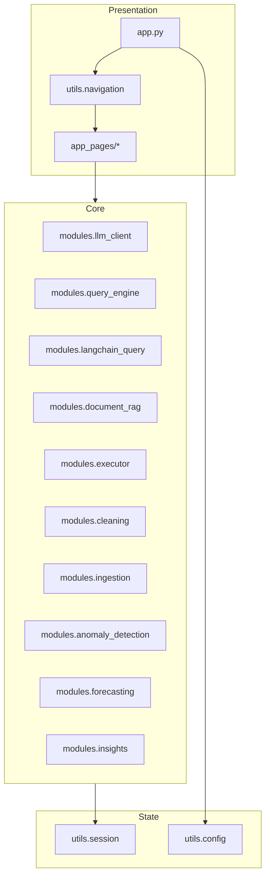

### Layered Architecture
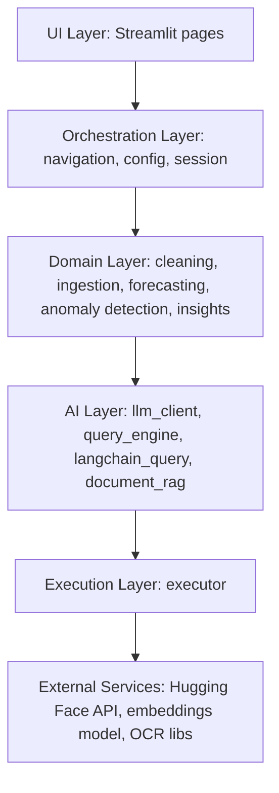

### Deployment Diagram
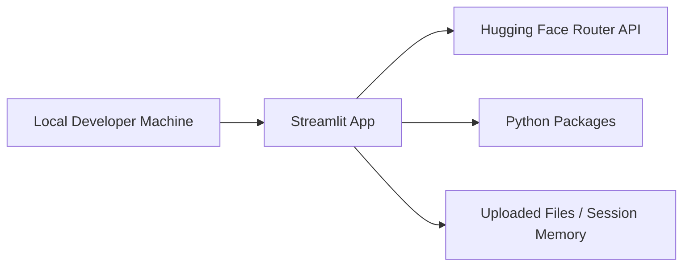

### Data Flow Diagram
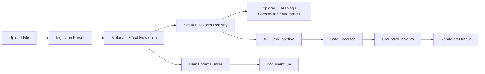

### Dependency Graph
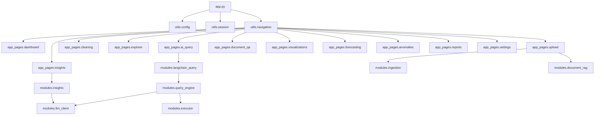

### Request Lifecycle
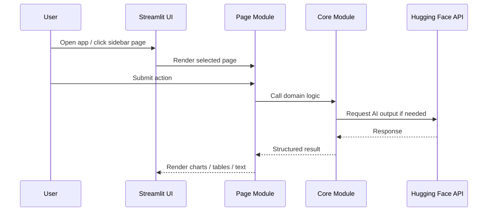

### Service Communication
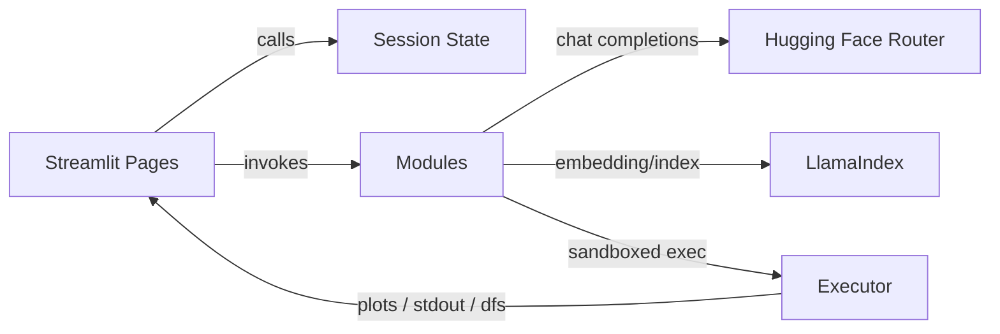

---

## 4. Complete Execution Flow

### Startup sequence
1. `app.py` runs as the Streamlit entry point.
2. `st.set_page_config(...)` configures the title, icon, wide layout, and sidebar state.
3. `load_config()` resolves the Hugging Face API key from Streamlit secrets or environment variables.
4. `init_session_state()` initializes default session keys such as datasets, query history, and theme.
5. `inject_css()` injects theme-aware CSS.
6. `render_navigation()` renders the sidebar and routes to the active page.
7. The selected page imports its feature-specific modules and renders its UI.

### Environment variables and secrets
- `HF_API_KEY` is the primary secret.
- It is read from `st.secrets["HF_API_KEY"]` first.
- If absent, `os.environ.get("HF_API_KEY")` is used.
- The sidebar can also accept the key at runtime.

### Dependency initialization
- Streamlit loads UI primitives.
- Pandas and NumPy are used across modules.
- Plotly is imported in most analytic pages.
- Matplotlib uses the non-interactive `Agg` backend.
- scikit-learn is imported only in the modules that need it.
- LlamaIndex and LangChain are optional and fall back gracefully if not installed.

### Model loading
- There is no local model checkpoint loading.
- All AI calls go through Hugging Face Inference Providers.
- LangChain and LlamaIndex are wrappers around retrieval and orchestration, not local model runtimes.

### Routing
- `utils.navigation.PAGES` maps sidebar labels to page IDs.
- `render_navigation()` updates `st.session_state.active_page`.
- `_route_page()` imports the correct page module and executes `render()`.

### Business logic
- Upload page parses files and registers them.
- Cleaning page mutates the dataframe after the user confirms.
- Explorer page reads the active dataframe and renders analysis tabs.
- AI Query page asks for code generation, executes code in a sandbox, and renders grounded insights.
- Insights page summarizes the active dataframe statistically and narratively.
- Forecasting and anomaly pages run specialized analytics.
- Reports page creates downloadable artifacts.
- Document QA page retrieves relevant text chunks and generates grounded answers.

### Database interaction
- There is no app database connection or migration system.
- SQLite is treated as an uploaded data source, not application storage.
- State is stored in memory via Streamlit session state.

### AI inference
- `modules.llm_client.query_llm()` performs all model calls.
- The client sends a chat payload to Hugging Face.
- It retries on throttling and reports friendly errors for authorization or quota failures.
- AI answers are cleaned to remove `<think>` blocks and excessive blank lines.

### Logging
- The project does not include a dedicated logging framework yet.
- Errors are generally displayed directly in the Streamlit UI or returned in result objects.

### Error handling
- Parsing failures raise wrapped runtime exceptions.
- The sandbox blocks dangerous imports and calls before execution.
- LLM failures are converted to user-friendly messages.
- Forecasting, anomaly detection, and cleaning pages catch exceptions and display them in the UI.

---

## 5. Module-by-Module Analysis

### `modules.llm_client`
- Purpose: API adapter for Hugging Face chat completions.
- Functions:
  - `clean_response(text)`: removes `<think>` blocks and extra whitespace.
  - `_call_hf(model, messages, max_tokens, temperature, timeout)`: sends the HTTP request.
  - `_get_model_chain()`: returns the primary/fallback model order.
  - `_friendly_http_error(status, body)`: converts HTTP errors into user-facing messages.
  - `query_llm(...)`: retries requests and returns `(response_text, model_used)`.
  - `extract_python_code(text)`: pulls Python code blocks from a response.
  - `extract_json(text)`: extracts JSON from code fences or raw text.
- Inputs: system/user prompts, max tokens, temperature, session API key.
- Outputs: raw text, code blocks, JSON objects, or error strings.
- Exceptions: HTTP errors, timeouts, malformed responses.
- Design: thin provider abstraction, no direct app logic.
- Complexity: moderate network/retry logic.
- Improvements: add structured response schemas and telemetry.

### `modules.executor`
- Purpose: safely run AI-generated code.
- Classes: `ExecutionResult`.
- Functions:
  - `validate_code(code)`: AST-based validation and blocked-call scanning.
  - `clean_code(code)`: strips imports, `show()` calls, and dataframe loading.
  - `execute_code(code, df, timeout=30)`: runs code in a constrained namespace.
- Inputs: generated Python code and active dataframe.
- Outputs: stdout, figures, created DataFrames, runtime, success flag, or error string.
- Exceptions: syntax issues, runtime exceptions, blocked-import detections.
- Design: sandbox + executor facade.
- Complexity: moderate due to security restrictions and output capture.
- Improvements: stricter timeout enforcement and AST allowlist.

### `modules.query_engine`
- Purpose: end-to-end dataframe question pipeline.
- Functions:
  - `build_context(...)`: composes dataset metadata, sample data, stats, and history into a prompt.
  - `build_repair_prompt(...)`: adds failed code and traceback to a repair prompt.
  - `build_execution_summary(...)`: serializes executor output into grounded text.
  - `build_final_insights_prompt(...)`: prepares a final insight prompt from actual results.
  - `build_fallback_insights(...)`: returns deterministic text if LLM insights fail.
  - `generate_final_insights(...)`: asks the LLM for grounded narrative.
  - `run_query(...)`: orchestrates generation, execution, repair, and insights.
- Inputs: dataframe, question, optional history, token budget.
- Outputs: structured dict with code, execution results, insights, model usage, error.
- Exceptions: code execution failures and LLM API errors.
- Design: prompt + execute + repair + summarize loop.
- Complexity: high relative to other modules because it owns the analytics workflow.
- Improvements: make repair deterministic, add confidence scoring, expose better provenance.

### `modules.langchain_query`
- Purpose: optional LangChain wrapper around the query pipeline.
- Functions:
  - `langchain_available()`: returns whether LangChain imports succeeded.
  - `_build_codegen_chain()`: builds a prompt + runnable chain.
  - `_generate_code(...)`: generates code through LangChain or direct fallback.
  - `run_query_langchain(...)`: mirrors the core pipeline but labels orchestration as LangChain.
- Inputs: dataframe, question, history, token budget.
- Outputs: same structure as `run_query`.
- Exceptions: chain build or prompt execution failures.
- Design: adapter/facade over existing orchestration.
- Complexity: moderate, but currently still delegates model calls to `query_llm`.
- Improvements: replace the wrapper with a true chat model object if a LangChain-native provider is desired.

### `modules.document_rag`
- Purpose: document retrieval and QA.
- Functions:
  - `llamaindex_available()`: indicates whether LlamaIndex imports succeeded.
  - `_split_text(...)`: chunks long text into overlapping pieces.
  - `build_document_bundle(...)`: creates a vector index or fallback bundle.
  - `store_document_bundle(...)`: stores bundles in session state.
  - `get_document_bundle(...)`: retrieves the stored bundle.
  - `_fallback_retrieve(...)`: keyword/similarity fallback retrieval.
  - `_format_context(...)`: serializes retrieved chunks.
  - `answer_document_question(...)`: retrieves relevant chunks and asks the LLM to answer from them.
- Inputs: document text, question, metadata.
- Outputs: answer text, retrieved chunks, engine used, model used.
- Exceptions: retrieval or embedding initialization failures.
- Design: RAG-style retrieval + generation.
- Complexity: moderate.
- Improvements: persist indexes across sessions, add citations, support multiple documents per dataset.

### `modules.ingestion`
- Purpose: multi-format file parsing and metadata extraction.
- Functions:
  - `detect_encoding(...)`.
  - `infer_dtypes(...)`.
  - `compute_metadata(...)`.
  - `load_csv(...)`, `load_excel(...)`, `load_json(...)`, `load_sqlite(...)`.
  - `parse_uploaded_file(...)`.
- Inputs: uploaded files.
- Outputs: dataframe + metadata, or text content + metadata.
- Exceptions: file parsing errors and unsupported formats.
- Design: format-specific loader functions with shared metadata creation.
- Complexity: moderate.
- Improvements: better nested JSON support, multi-sheet Excel selection, OCR progress display.

### `modules.cleaning`
- Purpose: dataframe quality improvement.
- Classes: `CleaningConfig`, `CleaningReport`.
- Functions:
  - `compute_quality_score(...)`.
  - `normalize_column_names(...)`.
  - `fill_missing(...)`.
  - `detect_outliers_zscore(...)`, `detect_outliers_iqr(...)`.
  - `clean_dataframe(...)`.
- Inputs: dataframe and config.
- Outputs: cleaned dataframe and structured report.
- Exceptions: edge cases in dtype conversion or outlier calculations.
- Design: explicit config + report dataclasses.
- Complexity: moderate.
- Improvements: handle empty frames more defensively and add per-column strategy overrides.

### `modules.anomaly_detection`
- Purpose: anomaly detection algorithms with visuals.
- Class: `AnomalyResult`.
- Functions:
  - `detect_isolation_forest(...)`.
  - `detect_zscore(...)`.
  - `detect_iqr(...)`.
- Inputs: dataframe and algorithm parameters.
- Outputs: anomaly result object with indices, subset dataframe, scores, and Plotly figure.
- Exceptions: missing numeric columns.
- Design: algorithm-specific functions, single result container.
- Complexity: moderate.
- Improvements: make feature selection configurable and add anomaly explanation text.

### `modules.forecasting`
- Purpose: simple forecasting methods.
- Class: `ForecastResult`.
- Functions:
  - `_make_time_index(...)`.
  - `moving_average_forecast(...)`.
  - `linear_trend_forecast(...)`.
  - `exponential_smoothing_forecast(...)`.
- Inputs: numeric series and horizon parameters.
- Outputs: forecast values, confidence bands, figures, metrics, and interpretation.
- Exceptions: short or empty series.
- Design: simple classical-statistics forecasts, not ML training.
- Complexity: moderate.
- Improvements: support explicit time indices and seasonal methods.

### `modules.insights`
- Purpose: statistical summary and LLM business insights.
- Functions:
  - `generate_statistical_insights(...)`.
  - `generate_llm_insights(...)`.
- Inputs: dataframe and max token budget.
- Outputs: list of insights or structured dict of insight fields.
- Exceptions: JSON parsing failures or model API failures.
- Design: deterministic quick insights plus optional narrative layer.
- Complexity: low to moderate.
- Improvements: robust JSON schema validation and better fallback formatting.

### `app_pages.*`
All pages are thin orchestration layers around `modules/` and `utils/`. They are intentionally stateful because Streamlit reruns the script on every interaction.

### `utils.config`
- Purpose: startup configuration and secret loading.
- Inputs: Streamlit secrets and environment variables.
- Outputs: session state settings.
- Improvements: centralize model defaults and add validation.

### `utils.session`
- Purpose: application state registry.
- Inputs: datasets, metadata, history, snapshots.
- Outputs: convenience accessors and state mutations.
- Improvements: move toward typed dataclasses and persisted state if needed.

### `utils.navigation`
- Purpose: sidebar navigation and page routing.
- Inputs: session state and loaded datasets.
- Outputs: selected page render.
- Improvements: replace button routing with a more explicit nav state model if the app grows.

---

## 6. Class Diagrams

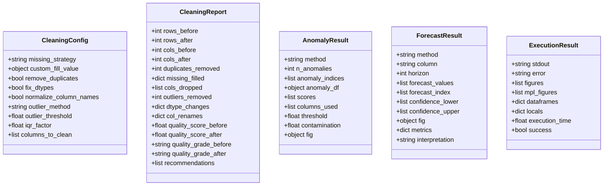

### Relationship notes
- `CleaningConfig` is consumed by `clean_dataframe`.
- `CleaningReport` is produced by `clean_dataframe`.
- `AnomalyResult` is produced by each anomaly detector.
- `ForecastResult` is produced by each forecasting method.
- `ExecutionResult` is produced by the sandbox and consumed by the query engine.

---

## 7. Sequence Diagrams

### User request
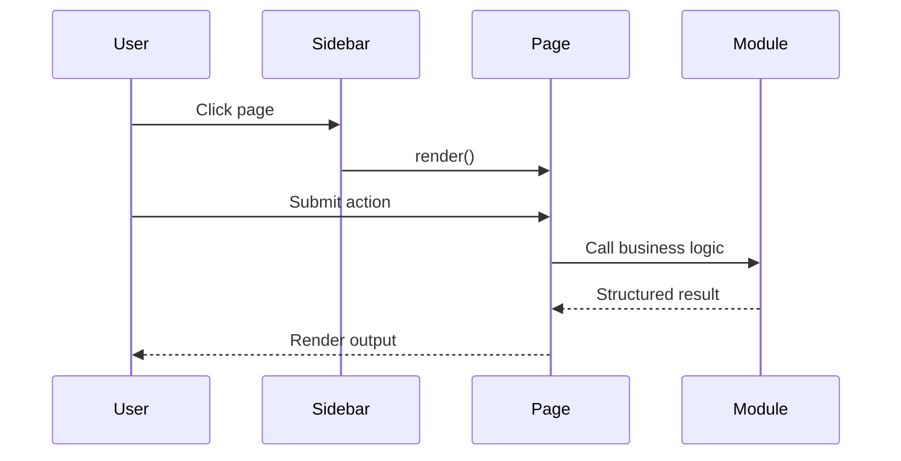

### Authentication
There is no app login flow. Authentication means Hugging Face API authentication.
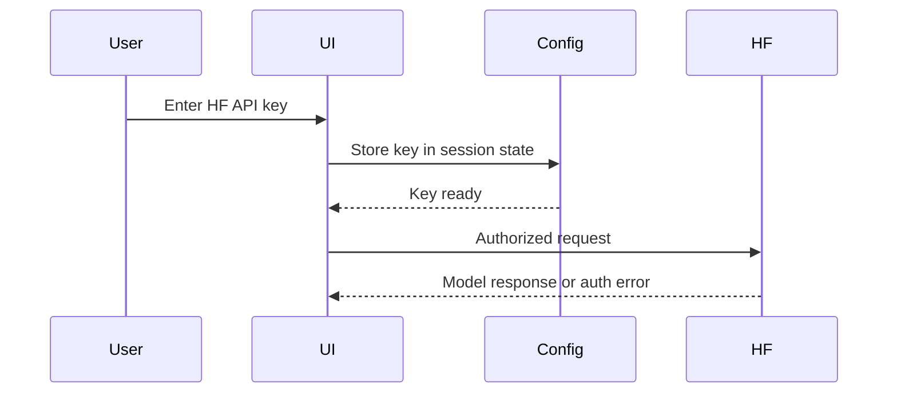

### Prediction pipeline
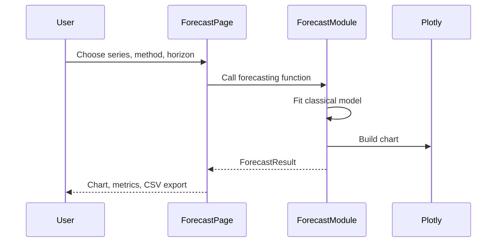

### API call
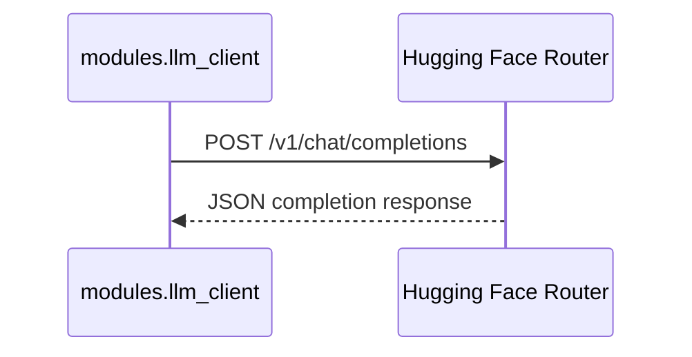

### Database query
There is no application database query layer. SQLite is read as an uploaded file and converted into a dataframe.

### AI inference
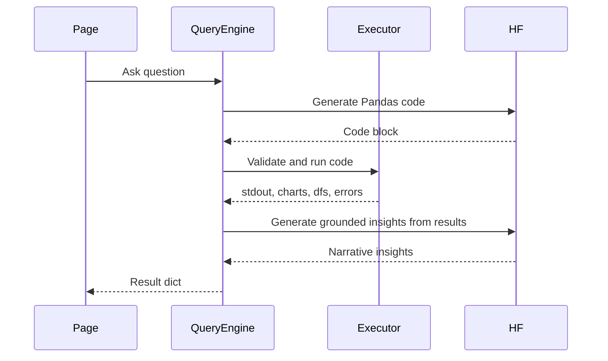

### Error handling
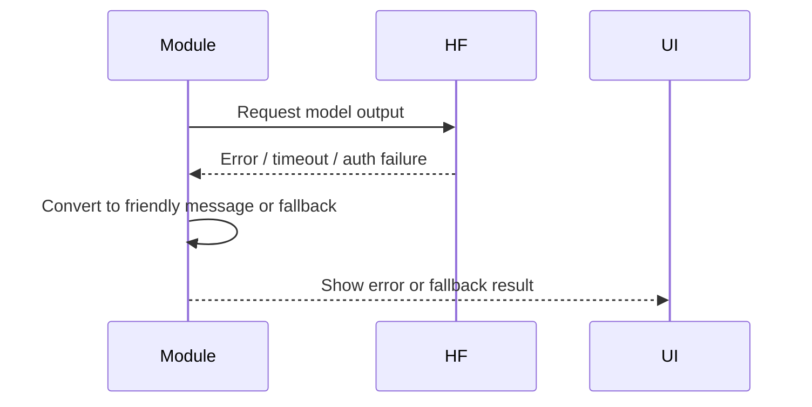

---

## 8. API Documentation

This project does not expose a traditional REST API. It is a Streamlit application with internal page routes. The only external API call is the Hugging Face chat completion endpoint.

### Internal page routes
These are UI routes, not HTTP endpoints:
- Dashboard
- Data Upload
- Data Cleaning
- Data Explorer
- AI Query
- Document QA
- Visualizations
- Insights
- Forecasting
- Anomaly Detection
- Reports
- Settings

### External Hugging Face request
- Route: `https://router.huggingface.co/v1/chat/completions`
- Method: `POST`
- Purpose: code generation, repair, narrative insights, and document QA.
- Headers:
  - `Authorization: Bearer <HF_API_KEY>`
  - `Content-Type: application/json`
- Request body:
  - `model`
  - `messages`
  - `max_tokens`
  - `temperature`
  - `stream: false`
  - `extra_body.reasoning: false`
- Status codes handled:
  - `400-404`: fatal user-facing errors
  - `429`: retry with exponential backoff
  - `500/503`: model unavailable, try fallback model
- Error cases:
  - Missing API key
  - Invalid token
  - Quota exhaustion
  - Model unavailable
  - Unexpected response schema

### Example request
```json
{
  "model": "deepseek-ai/DeepSeek-R1",
  "messages": [
    {"role": "system", "content": "..."},
    {"role": "user", "content": "..."}
  ],
  "max_tokens": 2048,
  "temperature": 0.3,
  "stream": false,
  "extra_body": {"reasoning": false}
}
```

### Example response
```json
{
  "choices": [
    {
      "message": {
        "content": "```python\nprint(df.head())\n```"
      }
    }
  ]
}
```

---

## 9. Machine Learning / AI Pipeline

### What AI / ML exists in the project
- LLM-based code generation and insight generation.
- LlamaIndex retrieval for document QA.
- Isolation Forest anomaly detection.
- Linear regression forecasting.
- Exponential smoothing and moving average forecasting.

### Dataset handling
- Uploaded tabular files become Pandas DataFrames.
- Text files become plain text content and are also stored in session state.
- OCR, PDF, and DOCX content is extracted into text before retrieval.

### Data preprocessing
- `infer_dtypes()` in ingestion tries numeric and datetime conversion.
- Cleaning can normalize columns, infer/fix dtypes, fill missing values, and remove duplicates.
- `build_context()` summarizes dataframe shape, schema, sample rows, and stats.
- Document QA chunks text into overlapping windows.

### Feature engineering
- No explicit supervised-learning feature engineering pipeline exists.
- Forecasting uses simple time/index transforms.
- Anomaly detection uses standardized numeric features internally.
- Document QA uses chunk-level text representations and embeddings.

### Model architecture
- No trained deep-learning architecture is stored in this repo.
- Classical statistical methods are used for forecasting.
- scikit-learn models power anomaly detection.
- Hugging Face serves the LLM inference model.

### Training and validation
- No offline training loop is implemented.
- No model checkpointing or validation split exists in the repo.
- Forecasting and anomaly modules are inference-only methods.

### Inference
- Prompt creation is handled by query and insights modules.
- Output is filtered, parsed, and then either executed or displayed.
- The AI Query pipeline uses generated Python code as an intermediate representation.

### Evaluation metrics
- Cleaning uses a quality score from 0-100.
- Forecasting returns simple metrics like slope, intercept, and R² for linear trend.
- Anomaly detection exposes counts and rates.
- There is no formal ML leaderboard or validation metric suite.

### Post-processing
- Generated text is cleaned before display.
- Generated code is validated before execution.
- Document QA displays retrieved chunks when the model is unavailable.

### Confidence scoring
- No calibrated confidence score is exposed.
- Forecasting and anomaly modules expose simple confidence bands or thresholds.
- LlamaIndex returns top-k retrieval results but no explicit confidence score is surfaced.

### AI pipeline diagram


---

## 10. Data Flow

### Tabular data flow
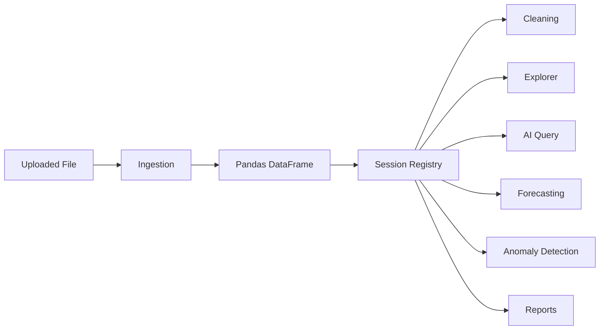

### Document data flow
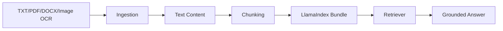

### Output flow
- Validation happens before execution.
- Transformation happens in cleaning and ingestion.
- Processing happens in the analytical modules.
- Storage happens in session state and downloaded files.
- Output is rendered as tables, charts, narratives, and exported artifacts.

---

## 11. Database

### Application database
- None.

### Data storage model
- `st.session_state.datasets` stores active dataframe records.
- `st.session_state.query_history` stores query records.
- `st.session_state.dataset_versions` stores dataframe snapshots.
- `st.session_state.document_indexes` stores document QA bundles.

### SQLite support
- SQLite is an input format, not an application backend.
- `modules.ingestion.load_sqlite()` reads tables from an uploaded `.db` file into separate dataframes.

### ORM usage
- None.

### Migration strategy
- None.

### Indexes
- No database indexes exist.
- LlamaIndex builds vector retrieval structures in memory when possible.

---

## 12. Configuration Files

### [requirements.txt](requirements.txt)
Defines the full dependency set for the project.

Key groups:
- UI: Streamlit.
- Data wrangling: Pandas, NumPy.
- Visualization: Plotly, Matplotlib, Seaborn.
- ML: scikit-learn, SciPy, statsmodels.
- File support: openpyxl, xlrd, python-docx, PyMuPDF, Pillow, pytesseract, chardet.
- AI: requests, huggingface-hub, langchain, llama-index-core, llama-index-embeddings-huggingface, sentence-transformers.
- Reporting: reportlab, fpdf2, Jinja2, python-pptx.
- Runtime support: psutil.

### [.streamlit/config.toml](.streamlit/config.toml)
- Sets dark theme defaults.
- Limits upload size to 200 MB.
- Enables XSRF protection.

### [.streamlit/secrets.toml.example](.streamlit/secrets.toml.example)
- Template for `HF_API_KEY`.
- Should not be committed as a real secrets file.

### [.gitignore](.gitignore)
- Ignores Python caches, venvs, `.env`, Streamlit secrets, logs, notebooks, exports, and uploaded data.

### `utils/config.py`
- Bootstraps session state with defaults.
- Reads secrets and environment variables.
- Sets model defaults and theme defaults.

### Missing files that are not present
- No `pyproject.toml`.
- No `Dockerfile` in the repository.
- No `docker-compose.yml`.
- No GitHub Actions workflows.
- No VS Code settings files.

---

## 13. External Dependencies

### Streamlit
- Purpose: app UI framework.
- Alternatives: Dash, Gradio, FastAPI + frontend, Panel.
- Advantages: rapid development, stateful widgets, low boilerplate.
- Disadvantages: rerun model can be limiting for large apps.

### Pandas / NumPy
- Purpose: dataframe and numerical processing.
- Alternatives: Polars, DuckDB.
- Advantages: ubiquitous and familiar.
- Disadvantages: can be slower and more memory-hungry than newer engines.

### Plotly
- Purpose: interactive visualizations.
- Alternatives: Matplotlib, Altair, Bokeh.
- Advantages: interactive, web-friendly, rich chart support.
- Disadvantages: larger payloads and more verbose APIs.

### scikit-learn
- Purpose: Isolation Forest, PCA, linear regression, standardization.
- Alternatives: statsmodels for some tasks, PyOD for anomalies.
- Advantages: stable and familiar.
- Disadvantages: not specialized for all anomaly/time-series tasks.

### Hugging Face Inference Providers
- Purpose: remote LLM inference.
- Alternatives: OpenAI, Together AI, local models, Azure OpenAI.
- Advantages: simple provider abstraction.
- Disadvantages: network latency and quota limits.

### LangChain
- Purpose: orchestration wrapper for question handling.
- Alternatives: custom orchestration only.
- Advantages: standard chain abstractions.
- Disadvantages: extra dependency if it only wraps a custom client.

### LlamaIndex
- Purpose: document retrieval and RAG.
- Alternatives: LangChain retrievers, custom vector store, FAISS-only flow.
- Advantages: retrieval primitives and document indexing abstraction.
- Disadvantages: additional optional dependency and complexity.

### PyMuPDF, python-docx, Pillow, pytesseract, chardet
- Purpose: document parsing, OCR, and encoding detection.
- Alternatives: pdfplumber, docx2txt, EasyOCR, charset-normalizer.
- Advantages: broad file support.
- Disadvantages: external system dependencies for OCR quality.

---

## 14. Design Patterns

### MVC-like separation
- View: `app_pages/*`.
- Model / domain logic: `modules/*`.
- Controller / routing: `utils/navigation.py`.

### Facade
- `modules.query_engine` acts as a facade over prompt creation, execution, repair, and insight generation.

### Adapter
- `modules.llm_client` adapts the Hugging Face HTTP API into a simpler Python function.
- `modules.langchain_query` adapts the existing query engine into a LangChain-shaped flow.
- `modules.document_rag` adapts LlamaIndex retrieval into the app’s session workflow.

### Strategy
- Cleaning strategies: mean, median, mode, ffill, bfill, drop_rows, drop_cols.
- Anomaly strategies: Isolation Forest, Z-Score, IQR.
- Forecast strategies: moving average, linear trend, exponential smoothing.

### Builder
- Prompt construction functions build structured prompts from dataset metadata and execution history.

### Singleton-like state
- Streamlit session state behaves like a shared runtime store for the app session.

### Service layer
- `modules/*` functions are effectively service-layer operations called by UI pages.

---

## 15. Performance Analysis

### Bottlenecks
- Hugging Face network calls are the main latency source.
- OCR and PDF parsing can be slow for large files.
- `df.describe()` and correlation matrices can be expensive on wide datasets.
- LlamaIndex indexing and embedding generation can be costly on large text corpora.

### Memory usage
- Session state stores dataframe copies and version snapshots.
- Cleaning version snapshots copy full dataframes.
- Executor copies the dataframe before code execution.
- Large uploads can increase memory pressure.

### CPU-intensive sections
- OCR, parsing, anomaly detection, correlation calculations, and visualization generation.
- PCA in anomaly detection.
- Repeated execution of generated Pandas code.

### Network latency
- Every LLM request depends on Hugging Face response time.
- Retry/backoff increases worst-case latency.

### Caching opportunities
- Cache extracted metadata and dataframe profiles.
- Cache document indexes across reruns.
- Cache correlation matrices for the active dataset.
- Cache LLM responses when the prompt and dataset hash have not changed.

### Concurrency and parallelism
- The app is mostly single-user and rerun-driven.
- There is no explicit async execution.
- Heavy operations run synchronously in the current Streamlit session.

### Scalability improvements
- Offload indexing and AI calls to background jobs.
- Move session state to persisted storage.
- Use a dedicated vector store and persisted embeddings.
- Introduce dataset hashing and result caching.

---

## 16. Security Review

### Secrets exposure
- `HF_API_KEY` is not hardcoded, but runtime values live in session state.
- `.streamlit/secrets.toml` is ignored by Git.

### Authentication and authorization
- There is no user login system.
- Anyone with access to the app can use the configured API key if exposed in the session.

### SQL injection
- No SQL execution against user-supplied queries is present.
- SQLite files are read as data, not executed as commands.

### XSS
- The app renders some HTML through `unsafe_allow_html=True`.
- Content sourced from LLMs or user data should be treated carefully.
- HTML escaping is recommended for any user-controlled narrative rendered as raw HTML.

### CSRF
- Streamlit’s XSRF protection is enabled in config.

### Prompt injection
- Document QA and AI Query are both vulnerable to prompt injection through uploaded content.
- The app mitigates this partially with system prompts, grounded execution, and code sandboxing.
- More robust content filtering and citation enforcement would improve safety.

### Unsafe deserialization
- Not present in the obvious flow.
- Uploaded file parsing should still be kept strict.

### File upload risks
- Large uploads can consume memory.
- OCR and PDF parsers may expose parsing vulnerabilities if not patched.
- Downloaded exports may reveal sensitive source data.

### API vulnerabilities
- Invalid tokens and quota exhaustion are surfaced to users.
- The Hugging Face token should never be committed.

### Recommendations
- Sanitize all HTML-rendered strings.
- Add output escaping for LLM text before using raw HTML blocks.
- Add size and type checks for uploads.
- Consider a true auth layer for multi-user deployments.
- Keep OCR and parser dependencies up to date.

---

## 17. Error Handling

### Logging
- No centralized logging subsystem exists.
- Most errors are shown through Streamlit `st.error()` or returned in structured dicts.

### Exception handling
- Parsing wraps errors in `RuntimeError`.
- Cleaning and forecasting pages catch exceptions around execution.
- AI Query returns an error string when the LLM layer fails.

### Retry logic
- `modules.llm_client.query_llm()` retries on `429` and waits exponentially.
- Timeouts also retry before giving up.

### Fallbacks
- Fallback model chain is supported if primary model fails.
- Fallback insights are returned if the final insight call fails.
- Document QA falls back to simple similarity retrieval if LlamaIndex is unavailable.
- `modules.document_rag` can return retrieved text directly when model calls fail.

### Validation
- Generated code is AST-validated and stripped of dangerous imports and calls.
- Cleaning quality score and forecast/anomaly preconditions guard feature availability.

### Recovery mechanisms
- Repair prompts attempt to fix runtime errors in generated code.
- Query history allows rerunning earlier questions.
- Dataset version snapshots allow rollback to a previous dataframe.

---

## 18. Testing

### Current testing state
- The repository contains one manual Hugging Face connectivity check in `test_hf.py`.
- There is no automated unit test suite or integration test suite.
- There is no `pytest` configuration, fixture set, or coverage tooling.

### Mocking
- None implemented.

### Suggested testing strategy
- Unit tests for ingestion functions by file type.
- Unit tests for cleaning strategy outcomes.
- Unit tests for the executor validation logic.
- Unit tests for prompt-building helpers.
- Integration tests for `run_query` and `answer_document_question` with mocked LLM calls.
- UI smoke tests for page rendering with an active dataset.

### Additional tests to add
- Empty dataframe handling.
- Invalid JSON / PDF / DOCX parsing.
- LLM failure fallback behavior.
- Document retrieval fallback path.
- Security tests for blocked imports and dangerous calls.
- Report generation tests for HTML and Excel exports.

---

## 19. Deployment

### Docker
- The repository does not include a Dockerfile, but the app can be containerized with a simple Streamlit image.

### Cloud deployment
- Streamlit Cloud is the most natural deployment target.
- Hugging Face API key must be set in secrets or environment variables.

### CI/CD
- No pipeline is present.
- A future GitHub Actions workflow could run linting, tests, and a build smoke test.

### Environment variables
- `HF_API_KEY` is required for AI features.

### Production architecture
- Single Streamlit app process.
- Remote LLM inference.
- Session-state-backed user experience.

### Scaling strategy
- Scale vertically first.
- Move long-running tasks to background workers if concurrency increases.
- Persist datasets and document indexes externally if multi-user usage grows.

---

## 20. Code Quality Review

### Strengths
- Clear separation of UI and domain logic.
- Strong feature coverage for a single-file Streamlit app.
- Good use of dataclasses for structured algorithm outputs.
- Safe execution sandbox for LLM-generated code.
- Useful fallback behavior for several failure modes.
- Good interactive UX for analysts.

### Weaknesses
- Some modules are quite large and mix multiple responsibilities.
- There is little formal typing across the codebase.
- No automated tests.
- No logging or telemetry.
- Some HTML rendering uses unsafe allow-html paths.
- Session state is doing a lot of work that a richer state model or persistence layer might better own.

### Dead code / duplicate code / smells
- The README currently contained architecture text that no longer matched the implementation.
- Some pages use repeated chart or formatting logic that could be factored.
- Several functions assume non-empty data and could fail on edge cases.
- `modules.langchain_query` currently wraps the existing client rather than providing a native LangChain model integration.

### Refactoring opportunities
- Extract common UI helpers for cards, metrics, and download buttons.
- Break the larger pages into smaller render subfunctions.
- Add typed result models for query, forecast, anomaly, and insights outputs.
- Centralize error display and notification patterns.

### Technical debt
- No persistent storage.
- No test harness.
- No structured logging.
- Some optional dependencies are imported only at runtime without health checks.

---

## 21. Future Improvements

### Performance
- Cache expensive calculations and metadata.
- Persist document embeddings and indexes.
- Stream large-file processing.

### Architecture
- Introduce a service layer and typed domain models.
- Persist state in a database or object store.
- Separate document QA from dataset QA more explicitly.

### AI improvements
- Add citations to document QA answers.
- Add schema-validated structured outputs for insights.
- Add query intent routing between tabular QA, doc QA, and reporting.
- Add confidence and provenance metadata for generated answers.

### Security
- Escape all LLM-sourced HTML.
- Add user authentication for shared deployments.
- Strengthen prompt injection defenses.
- Limit upload size per file type and validate OCR inputs.

### Scalability
- Move indexing and heavy analytics to background jobs.
- Add a vector store backend.
- Support multi-user dataset isolation.

### Maintainability
- Add linting, typing, and tests.
- Refactor large page modules.
- Standardize error/result objects.

### Developer experience
- Add a Dockerfile.
- Add GitHub Actions.
- Add a reproducible dependency lock or environment file.
- Add examples and screenshots to the docs.

---

## 22. Interview Preparation

### 30 technical interview questions with answers

1. **What does this project do?**
   It is a Streamlit-based AI data analyst that lets users upload data, clean it, explore it, ask questions in natural language, generate reports, detect anomalies, forecast metrics, and query documents.

2. **Why did you choose Streamlit?**
   Because it is ideal for data apps, fast to prototype, and works well with interactive analytics workflows.

3. **Why is the code separated into `app_pages`, `modules`, and `utils`?**
   To keep UI, domain logic, and shared state/configuration separated and easier to maintain.

4. **What is the role of `modules.llm_client`?**
   It is the single adapter for Hugging Face LLM calls and response cleaning.

5. **How does AI Query work?**
   It builds a dataframe prompt, asks the LLM to generate Pandas code, validates and runs the code in a sandbox, and then generates grounded insights from the actual execution results.

6. **Why execute generated code instead of asking the LLM for the final answer directly?**
   Code execution allows factual grounding in the dataset and gives the user reproducible outputs and charts.

7. **How is unsafe code prevented?**
   The executor blocks dangerous imports and calls, cleans the code, and runs it in a restricted namespace.

8. **What happens if generated code fails?**
   The pipeline creates a repair prompt with the failed code and traceback, asks the LLM to fix it, and re-executes the repair if provided.

9. **How does the app handle missing API keys?**
   It loads them from secrets or environment, and if missing it warns the user in the UI.

10. **What is the role of LangChain here?**
    It wraps the dataframe query orchestration so the project can use LangChain abstractions without rewriting the existing analytics engine.

11. **What is the role of LlamaIndex here?**
    It indexes extracted text documents and retrieves relevant chunks for grounded question answering.

12. **Does the project use a database?**
    Not as an application backend; SQLite is only supported as an uploaded input source.

13. **How is session state used?**
    It stores datasets, active dataset, query history, version snapshots, and cached results.

14. **Why are cleaning operations versioned?**
    So users can rollback to a previous dataset snapshot if a cleaning step was too aggressive.

15. **How are forecasts generated?**
    With simple statistical methods: moving average, linear trend regression, and exponential smoothing.

16. **How are anomalies detected?**
    With Isolation Forest, Z-Score, and IQR algorithms.

17. **What are the main performance bottlenecks?**
    LLM latency, OCR parsing, and large dataframe computations.

18. **What is the biggest security risk?**
    Prompt injection and raw HTML rendering from untrusted text or LLM output.

19. **How does the project support document QA?**
    It chunks uploaded text, builds a LlamaIndex vector index, retrieves top-k chunks, and feeds them to the LLM.

20. **Why is there a sandbox?**
    To allow useful AI-generated code execution while reducing the risk of malicious or destructive operations.

21. **What is the fallback when LlamaIndex is unavailable?**
    It uses simple similarity scoring with `SequenceMatcher` over chunks.

22. **What is the fallback when the final insight generation fails?**
    The pipeline returns deterministic fallback insights built from execution outputs and errors.

23. **Why is the app not built with a REST API?**
    The Streamlit model is simpler for this use case and focuses on interactive data exploration rather than endpoint-heavy service design.

24. **How would you scale this app?**
    Add persistent storage, background jobs, caching, separate vector storage, and stronger auth if many users join.

25. **What testing would you add first?**
    Unit tests for ingestion, executor security, query pipeline, and document retrieval fallback.

26. **How do you prevent broken model output from destroying the UX?**
    By cleaning, validating, retrying, and falling back to deterministic outputs.

27. **Why are figures captured from the executor?**
    So AI-generated code can create charts that are displayed directly to the user.

28. **What is the design pattern of the query pipeline?**
    It is essentially a facade over prompt generation, execution, repair, and final summarization.

29. **What would you improve first in the codebase?**
    Add tests, logging, and stronger type modeling for result objects.

30. **Why is this architecture a good fit for the problem?**
    It combines low-friction interactive analytics with safe AI assistance and keeps the logic modular enough to extend.

### Common follow-up questions
- How do you handle hallucinations?
- Why not use a pure text-to-SQL or pure RAG architecture?
- How would you add persistence for user datasets?
- How would you support multi-user collaboration?
- How would you migrate to a backend/frontend split?

---

## 23. README Generation

### Suggested README structure
This repository should present itself as a Streamlit AI analytics app, not as a React/FastAPI/PostgreSQL stack.

Recommended README sections:
- Project overview.
- Feature list.
- Architecture diagram.
- Installation instructions.
- Environment variables and secrets.
- Quick start.
- Folder structure.
- Usage examples.
- Deployment guidance.
- Testing notes.
- Security notes.
- Roadmap.
- Contributing.
- License.
- Acknowledgements.

### Notes for a production README
- Mention that the app uses Hugging Face Inference Providers.
- Mention that LangChain and LlamaIndex are optional integration layers.
- Mention that there is no backend database.
- Mention the supported file formats.
- Mention the sandboxed code execution model.
- Mention that document QA only works on text-based uploads.

---

## Final Notes

### Assumptions used in this documentation
- The repository is a single Streamlit application and not a hidden multi-service backend.
- The existing folder structure is the authoritative implementation.
- There is no separate database or API server beyond Hugging Face requests.
- The code currently acts as both product UI and orchestration layer.

### Most important risks
- Prompt injection from uploaded content.
- HTML rendering of untrusted narrative strings.
- Memory growth from in-session dataframe snapshots.
- Dependency drift for OCR and embedding libraries.

### Best next refactors
- Add tests.
- Add logging.
- Persist document indexes.
- Escape all user- and model-derived HTML.
- Split large page modules into smaller render helpers.
