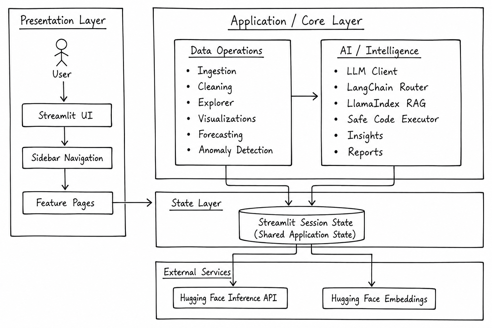
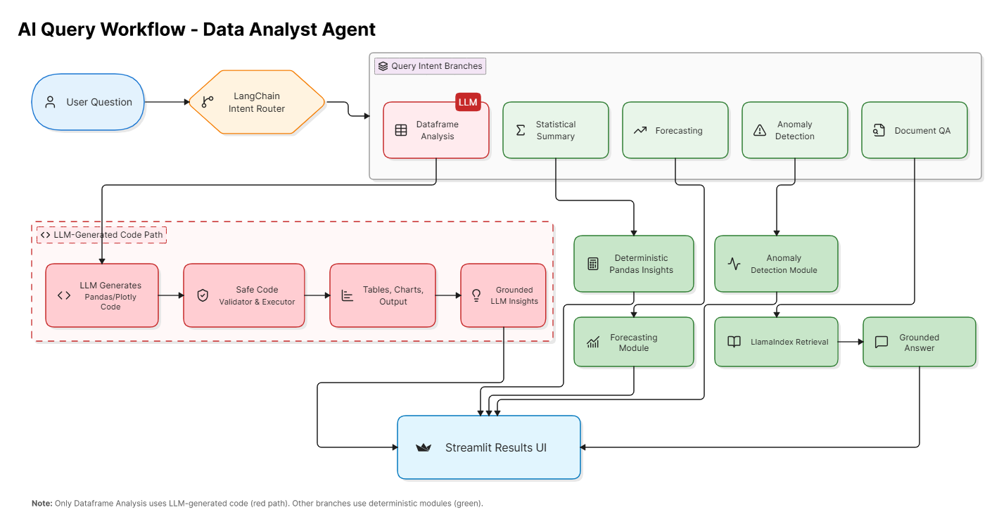
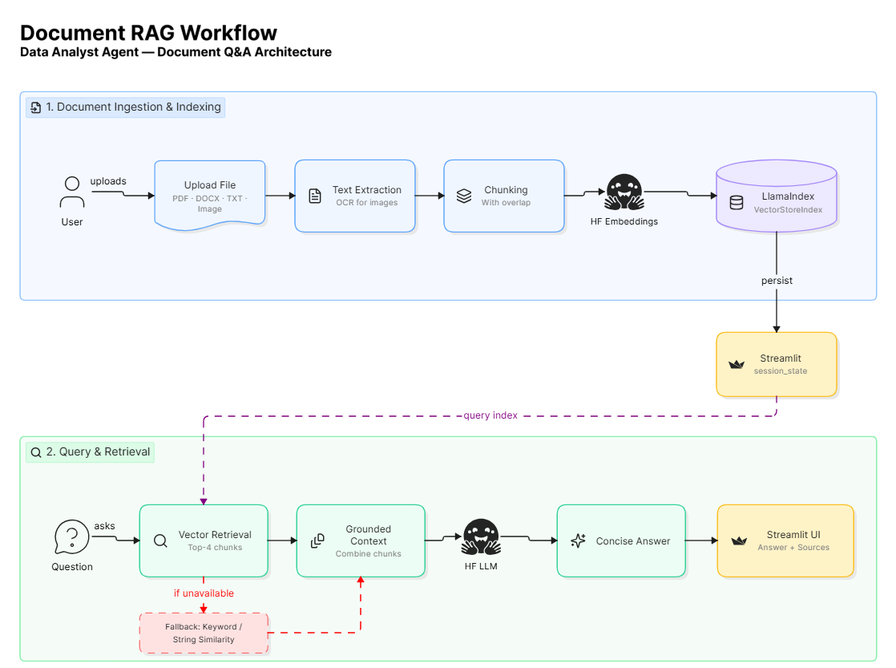
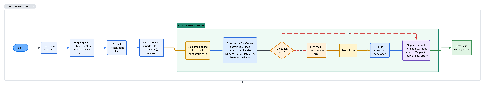

# Data Analyst Agent

An AI-powered Streamlit application that combines deterministic analytics with LLM-powered reasoning. Users can upload datasets and documents, explore and clean data, generate visualizations, forecast trends, detect anomalies, execute AI-generated analysis safely, and perform Retrieval-Augmented Generation (RAG) over documents through a unified natural-language interface.

---

## Features

- Upload CSV, Excel, JSON, SQLite, PDF, DOCX, TXT, and image files.
- Explore datasets with descriptive statistics, correlations, filtering, and visualizations.
- Clean and preprocess datasets with version snapshot support.
- Natural-language query interface powered by LangChain intent routing.
- Secure execution of LLM-generated Pandas and Plotly code inside a restricted sandbox.
- Deterministic statistical insights without unnecessary LLM execution.
- Time-series forecasting.
- Anomaly detection.
- Retrieval-Augmented Generation (RAG) for uploaded documents using LlamaIndex.
- Export analytical reports in HTML and Excel formats.

---

## System Architecture

### Overall Architecture

<p align="center">
  
</p>

The application follows a layered architecture consisting of:

- **Presentation Layer** – Streamlit UI, sidebar navigation, and feature pages.
- **Application Layer** – Data ingestion, cleaning, visualization, forecasting, anomaly detection, and exploration modules.
- **AI Layer** – LangChain intent router, Hugging Face LLM client, LlamaIndex RAG, safe code executor, insights, and reporting modules.
- **State Layer** – Streamlit Session State for managing shared application state.
- **External Services** – Hugging Face Inference API and Hugging Face Embedding models.

---

## AI Query Workflow

<p align="center">
  
</p>

User queries are first classified using a **LangChain Intent Router**, which directs requests to specialized workflows:

- **DataFrame Analysis** → LLM generates Pandas/Plotly code executed securely in a sandbox.
- **Statistical Summary** → Deterministic Pandas-based analysis.
- **Forecasting** → Time-series forecasting module.
- **Anomaly Detection** → Dedicated anomaly detection module.
- **Document QA** → LlamaIndex Retrieval-Augmented Generation pipeline.

Results from every workflow are unified and presented through the Streamlit interface.

---

## Document RAG Workflow

<p align="center">
  
</p>

The document question-answering pipeline consists of:

1. Upload PDF, DOCX, TXT, or image files.
2. Extract document text (OCR for images).
3. Split text into overlapping chunks.
4. Generate Hugging Face embeddings.
5. Build and persist a LlamaIndex vector index.
6. Retrieve the most relevant document chunks.
7. Generate grounded answers using retrieved context.
8. Fall back to keyword/string similarity retrieval if vector search is unavailable.

---

## Secure Code Execution

<p align="center">
  
</p>

For DataFrame analysis requests, AI-generated code follows a secure execution pipeline:

- LLM generates Pandas and Plotly code.
- Python code is extracted and sanitized.
- Dangerous imports, file I/O, shell commands, and unsafe operations are removed.
- AST validation blocks unsafe code.
- Code executes on a DataFrame copy inside a restricted namespace.
- Only approved libraries (Pandas, NumPy, Plotly, Matplotlib, Seaborn) are available.
- Execution failures trigger a single automatic repair attempt.
- Tables, charts, runtime information, and errors are captured before displaying results.

---

## Architecture Highlights

- Layered architecture separating presentation, application, AI, state management, and external services.
- LangChain-based intent routing for intelligent workflow selection.
- Hybrid design combining deterministic analytics with LLM-powered reasoning.
- Secure sandbox for executing AI-generated Pandas and Plotly code.
- LlamaIndex-powered Retrieval-Augmented Generation for document question answering.
- Shared application state managed through Streamlit Session State.

---

## Tech Stack

### Frontend

- Streamlit

### Data Processing

- Python
- Pandas
- NumPy

### Visualization

- Plotly
- Matplotlib
- Seaborn

### Machine Learning & Analytics

- scikit-learn
- SciPy
- statsmodels

### AI & LLM

- Hugging Face Inference API
- LangChain
- LlamaIndex

### Document Processing

- PyMuPDF
- python-docx
- Pillow
- pytesseract
- chardet

---

## Project Structure

```text
Data-Analyst-Agent/
│
├── app.py
├── app_pages/
├── modules/
├── utils/
├── Diagrams/
│   ├── system_architecture.png
│   ├── ai_query_workflow.png
│   ├── document_rag_workflow.png
│   └── safe_code_execution_diagram.png
├── requirements.txt
└── README.md
```

---

## Quick Start

Clone the repository:

```bash
git clone <repository-url>
cd Data-Analyst-Agent
```

Install dependencies:

```bash
pip install -r requirements.txt
```

Run the application:

```bash
streamlit run app.py
```

Configure your Hugging Face API key using one of the following:

- `.streamlit/secrets.toml`
- Environment variable (`HF_API_KEY`)
- Sidebar configuration

---

## Security

- AST-based validation before code execution.
- Restricted execution namespace.
- Dangerous imports and built-ins are blocked.
- DataFrame copy is used during execution to prevent accidental data modification.
- Automatic single-pass code repair for recoverable execution errors.
- Secrets are loaded securely from Streamlit Secrets or environment variables.
- Streamlit XSRF protection is enabled.

---

## Deployment

The application can be deployed locally or on Streamlit Community Cloud.

Configure the required `HF_API_KEY` in Streamlit Secrets or environment variables before deployment.

---

## License

This project is licensed under the MIT License.
