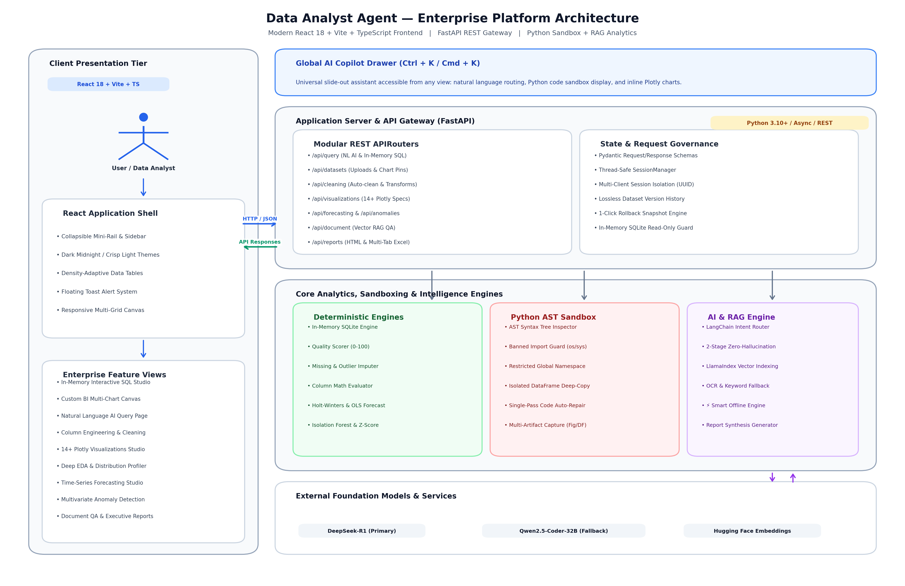
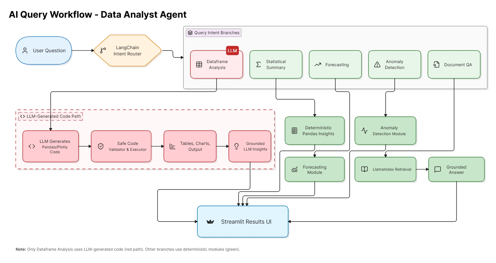
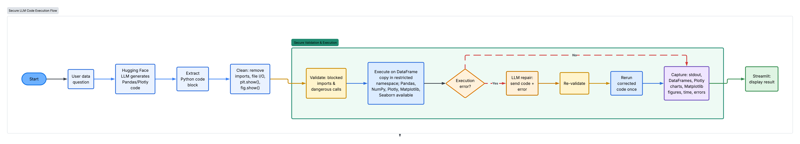
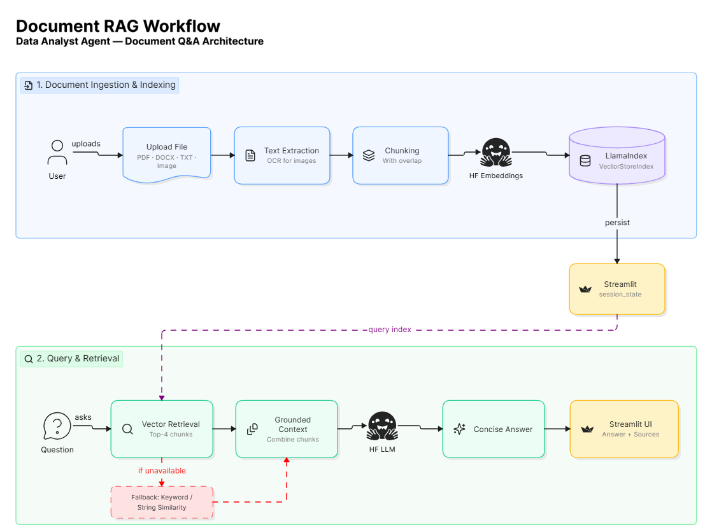

# Data Analyst Agent — Enterprise Edition (React + FastAPI)

An enterprise-grade, full-stack AI data analytics and business intelligence platform that combines **deterministic statistical engines**, **interactive SQL execution**, **custom BI dashboarding**, and **safe LLM code generation**.

Powered by a **FastAPI** backend, **React 18 + Vite + TypeScript** frontend, and **Hugging Face / Local Offline Analytic Engines**.

---

## 🏛️ System Architecture



---

## 🔄 Core Workflows

### 1. Natural Language AI Query Workflow


---

### 2. Secure Code Execution Sandbox


---

### 3. Document QA & Vector RAG Workflow


---

## ✨ Feature Suite

### 1. ⚡ In-Memory SQL Studio (`/sql`)
- Run interactive, read-only SQL queries (`SELECT`, `GROUP BY`, `JOIN`, `HAVING`) directly over your active Pandas DataFrame using SQLite `:memory:`.
- Real-time schema explorer with column type badges and 1-click query template generation.
- Millisecond query latency with instant CSV export.

### 2. 📌 Custom BI Multi-Chart Dashboard Canvas (`/custom-dashboard`)
- Pin any chart across the entire platform with one click using the 📌 pin button.
- Drag, inspect, annotate, and organize charts from Visualizations, AI Query, and Explorers.
- Fullscreen drilldown view and high-resolution PNG downloads.

### 3. 🛠️ Column Engineering Studio (`/cleaning`)
- Direct column modifications:
  - **Rename Columns**
  - **Cast Data Types** (`int`, `float`, `string`, `datetime`, `bool`)
  - **String Case Normalization** (`UPPERCASE`, `lowercase`, `Title Case`, `Strip Whitespace`)
  - **Custom Math Expressions** (e.g. `col_a / col_b * 100`)
  - **Create Computed Columns**
  - **Safe Column Dropping**
- Integrated with lossless version snapshots and instant 1-click rollback history.

### 4. 🤖 Global Persistent AI Copilot Side-Drawer (`Ctrl + K` / `Cmd + K`)
- Universal slide-out drawer accessible from any page via keyboard shortcut or navbar button.
- Real-time intent routing, Python code sandbox display, and inline Plotly chart rendering.

### 5. 🎨 Dual Themes & Scaled Typography
- **Dark Midnight Slate** and **Crisp Enterprise Light** themes with local storage persistence.
- Density switcher (*Compact / Standard / Relaxed*) on all data tables.
- Floating toast notification engine for smooth non-blocking alerts.

### 6. 📈 Time Series Forecasting & Anomaly Detection
- **Forecasting**: Moving Averages, Linear Trend Regression (OLS), and Exponential Smoothing (Holt-Winters) with 95% confidence bands.
- **Anomaly Detection**: Multivariate Isolation Forest, Gaussian Z-Score, and IQR anomaly scans with PCA 2D scatter projections.

### 7. 📑 Executive Reports & Data Exports
- Standalone interactive dark-mode HTML executive reports.
- Multi-tab formatted Excel workbooks (`.xlsx`) containing Data, Summary Statistics, Missing Value Diagnostics, Column Info, and Query History.

---

## 🚀 Quick Start Guide

### 1. Prerequisites
- Python 3.10+
- Node.js 18+ and npm

### 2. Setup & Installation

```bash
# Clone the repository
git clone https://github.com/Om-Suman/Data_Analyst_Agent.git
cd Data_Analyst_Agent

# Setup Python Virtual Environment
python -m venv venv
.\venv\Scripts\activate       # Windows PowerShell
# source venv/bin/activate    # Linux / macOS

# Install Python backend dependencies
pip install -r requirements.txt

# Install React frontend dependencies
cd frontend
npm install
cd ..
```

---

### 3. Running the Application

You can start the platform using either of the following methods:

#### Method A: Unified Single-Terminal Dev Command (Recommended)
```bash
cd frontend
npm run dev
```
*This starts both the FastAPI backend (`http://127.0.0.1:8000`) and the React Vite frontend (`http://localhost:5173`) concurrently in your single terminal window.*

#### Method B: Two Separate Terminals
- **Terminal 1 (Backend)**:
  ```bash
  # Start FastAPI backend
  uvicorn backend.main:app --host 127.0.0.1 --port 8000 --reload
  ```
- **Terminal 2 (Frontend)**:
  ```bash
  # Start React frontend
  cd frontend
  npm run dev
  ```

---

### 4. Running the Automated Test Suite

```bash
# Run all 15 integration and unit test suites
.\venv\Scripts\pytest.exe backend/tests -v
```

---

## 📂 Project Structure

```text
DataAnalystAgent/
├── backend/                      # FastAPI Backend Application
│   ├── api/                      # Modular REST API Route Handlers
│   │   ├── routes_config.py      # Hugging Face key & hyperparameter management
│   │   ├── routes_datasets.py    # Multi-format ingestion & pinned charts
│   │   ├── routes_cleaning.py    # Quality scoring & column engineering
│   │   ├── routes_explorer.py    # Paginated browse & distribution profiler
│   │   ├── routes_query.py       # Natural language & in-memory SQL runner
│   │   ├── routes_visualizations.py # 14+ Plotly figure builder
│   │   ├── routes_forecasting.py # Time-series models
│   │   ├── routes_anomalies.py   # Isolation Forest & outlier detection
│   │   ├── routes_document.py    # LlamaIndex RAG QA
│   │   ├── routes_insights.py    # Statistical rules & AI narrative stories
│   │   └── routes_reports.py     # HTML & multi-tab Excel export
│   ├── session/                  # Thread-Safe SessionState & SessionManager
│   ├── schemas/                  # Pydantic Schemas
│   ├── services/                 # Business Logic Services
│   └── tests/                    # Pytest Suite (15/15 passed)
│
├── frontend/                     # Modern React + Vite + TypeScript Frontend
│   ├── src/
│   │   ├── api/                  # Axios Client & API Endpoints
│   │   ├── components/           # PlotlyChart, DataTable, AICopilotDrawer, Toast
│   │   ├── context/              # DatasetContext & ThemeContext
│   │   ├── layouts/              # AppLayout shell with collapsible mini-rail
│   │   ├── pages/                # 12 Feature Pages (SQL Studio, BI Canvas, etc.)
│   │   └── types/                # TypeScript Interfaces
│   ├── package.json
│   ├── tailwind.config.js
│   └── vite.config.ts
│
├── modules/                      # Core Analytics & Intelligence Engines
│   ├── ingestion.py              # File readers (CSV, Excel, JSON, SQLite, PDF, DOCX, OCR)
│   ├── cleaning.py               # Auto-cleaning & quality scoring
│   ├── executor.py               # AST sandbox validator & executor
│   ├── llm_client.py             # Hugging Face client with quota auto-failover
│   ├── query_engine.py           # Smart fallback code generator & insights
│   ├── langchain_query.py        # LangChain Intent Routing & Code Pipeline
│   ├── document_rag.py           # LlamaIndex Document RAG
│   ├── forecasting.py            # Moving Average, Linear OLS, Holt-Winters
│   └── anomaly_detection.py      # Isolation Forest, Z-Score, IQR
│
├── Diagrams/                     # Architectural Workflow Diagrams
│   ├── system_architecture1.png
│   ├── ai_query_workflow.png
│   ├── safe_code_execution_diagram.png
│   └── document_rag_workflow.png
│
├── requirements.txt              # Python Dependencies
└── README.md
```

---

## 🔒 Security Architecture

- **AST Security Barrier**: Submitted Python scripts are parsed into an Abstract Syntax Tree (AST) to detect and block forbidden AST nodes (`Import`, `ImportFrom`, attribute access to private/dunder members, dangerous built-ins).
- **Restricted Namespace**: Code runs inside a restricted global namespace allowing only safe packages (`pandas`, `numpy`, `plotly`, `math`, `datetime`, `re`, `json`, `scikit-learn`).
- **DataFrame Immutability**: Code executions operate on deep copies of in-memory DataFrames to prevent accidental destructive state corruption.
- **Key Masking**: Hugging Face API keys are securely stored in backend memory sessions and masked in API responses (`****...tKdB`).
- **SQL Sanitization**: In-memory SQL execution allows only read-only `SELECT` queries, explicitly blocking destructive statements (`DROP`, `DELETE`, `TRUNCATE`, `ALTER`, `UPDATE`, `INSERT`).

---

## 📄 License
MIT License.
